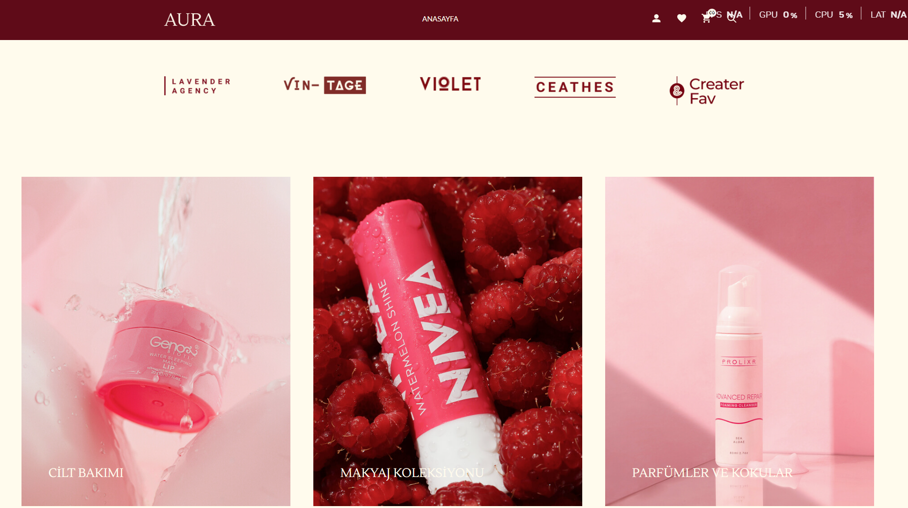
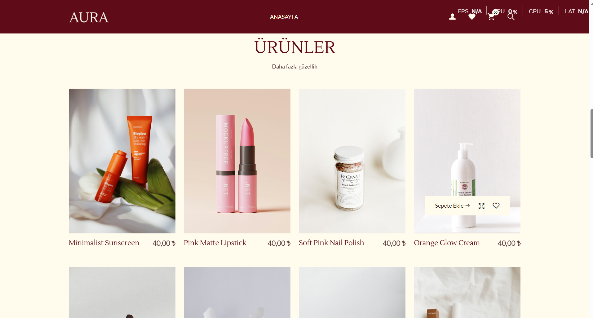
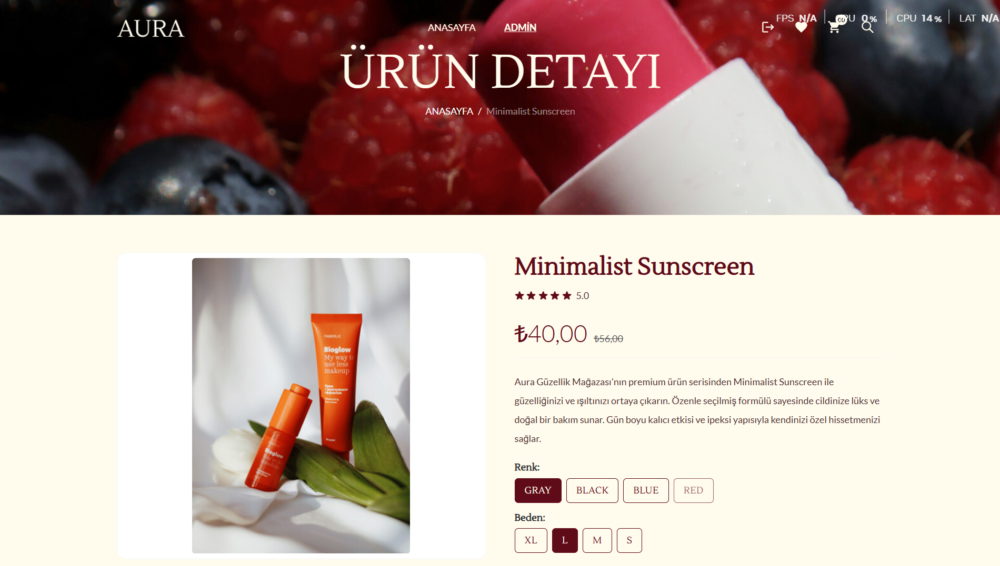
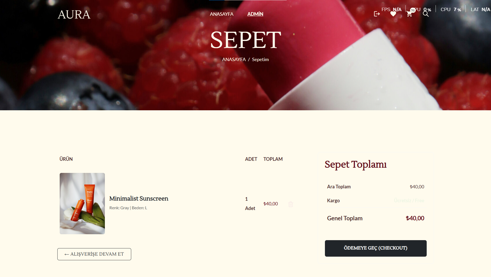
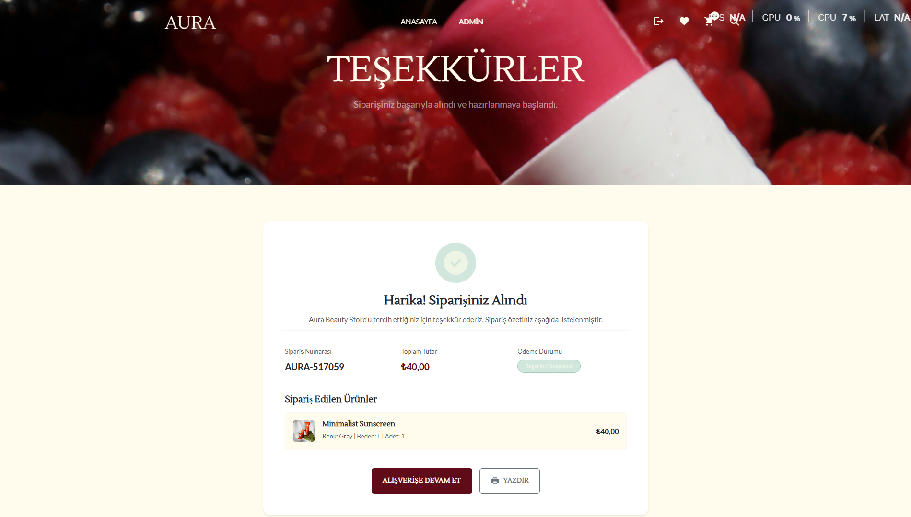
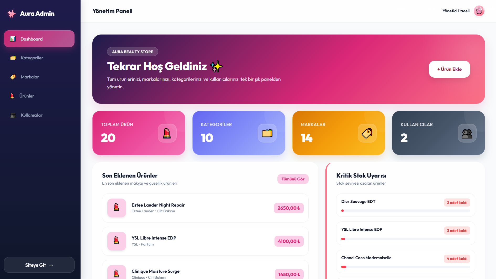

<!-- HEADER -->
<div align="center">

# 💄 Aura Beauty Store

### Premium Beauty & Cosmetics eCommerce Application with ASP.NET Core MVC & Web API

A premium beauty and cosmetics eCommerce application built using ASP.NET Core MVC (Frontend), ASP.NET Core Web API (Backend), Entity Framework Core, SQL Server and Bootstrap. The project features product catalogs, shopping cart session management, order checkout confirmation, and a responsive administrative dashboard.

---


</div>

---

# 📸 Project Screenshots

## Home Page


---

## Home Banner



---
## Products List



---

## Product Detail



---

## Shopping Cart



---

## Order Success Page



---

## Admin Dashboard



---

# 🚀 Project Features

### 🌸 Customer Side

- **Interactive Home Page**: Smooth scrolling hero slides, dynamic category lists, featured new arrivals catalog.
- **Product Details Page**: Dynamic options (color/size selectors), stock validation, Swiper carousel preview with thumbnails, dynamic tab panel (details, usage, shipping & returns, customer reviews).
- **Shopping Cart Management**: Session-based item storage, right slide-out mini-cart drawer with instant totals, main cart page with quantity increment/decrement controls.
- **Order Checkout**: Auto-calculated totals, session cleanup, order code generator, and printable Order Confirmation Success page.
- **Premium Aesthetics**: Elegant cream/beige theme `#fffbed` with rich burgundy accents `#5f0b18` and responsive design.

---

### 🛠 Admin Panel

- **Admin Dashboard**: Visual widgets displaying counts of products, categories, brands, and users.
- **Product CRUD**: Full creation, editing, visual uploads, and stock management.
- **Category CRUD**: Category listing and updates.
- **Brand CRUD**: Brand listing and updates.

---

# 🏗 Project Architecture

```text
09-AuraBeautyStore
│
├── MakeupStoreApi (Web API Project - Backend)
│   ├── Controllers (REST Endpoints)
│   ├── Models (Entity Layer)
│   ├── Data (DbContext & Migrations)
│   └── SQL Server LocalDB
│
└── MakeupStoreMvc (MVC Project - Frontend client)
    ├── Controllers (Home, Cart, Admin, Account)
    ├── Views (Razor templates with HSL/Vanilla CSS themes)
    ├── Models (ViewModels & DTOs)
    └── Session State (Memory Cache Cart Session)
```

---

# 🛠 Technologies

| Backend | Frontend | Database | Other |
|----------|----------|----------|--------|
| ASP.NET Core MVC | Bootstrap 5 | SQL Server | Entity Framework Core |
| ASP.NET Core Web API | HTML5 / CSS3 | Code First | LINQ Queries |
| C# | JavaScript (Vanilla) | Migration | Swiper.js |
| HttpClient (API Service) | Google Fonts | | Iconify Icons |
| Session State | Responsive Layout | | JSON Serialization |

---

# 📊 Modules

✔ Dynamic Product Catalog

✔ Session-Based Shopping Cart

✔ Right-Side Slide-out Cart Drawer

✔ Dynamic Product Details & Options

✔ Form-based Checkout Processor

✔ Order Confirmation Success Page (Printable)

✔ Admin Management Panel

✔ Category & Brand Management

✔ User Authentication & Roles

✔ HSL Colors & Premium Visual Animations

---

# 📂 Database Tables

| Table | Description |
|---------|-------------|
| Products | Stores product information, pricing, stock levels, images. |
| Categories | Handles cosmetic classification (e.g. Parfüm, Cilt Bakımı). |
| Brands | Stores cosmetic brand details (e.g. Chanel, Dior, MAC). |
| Users | Handles user authentication and administrative records. |

---

# 🎯 Learning Outcomes

- ASP.NET Core Multi-Project Structure (API + MVC Clients)
- REST API Design and HTTP Client Consumption
- ASP.NET Core Session Management (Cart implementation)
- Database Relations with Entity Framework Core Code-First
- Custom Theme Integration & CSS Variable Overrides
- Smooth Page Scrolling & Swiper Slideshow Customization
- Responsive Dashboard & Admin CRUD Panel Design

---

# ⭐ Project Status

✅ Completed

---

<div align="center">

Made with ❤️ using ASP.NET Core MVC & Web API

</div>
